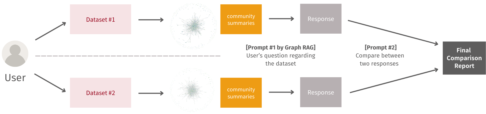

## InsightLink (Beta) 

> It is only a beta version that only provides command-line interface for specific case study only

InsightLink is an automated news analysis assistant that utilizes Graph Retrieval-Augmented Generation (Graph RAG) and Large Language Models (LLMs) to streamline insight extraction from extensive news datasets. Designed to support social scientists, InsightLink provides an efficient alternative to manual content analysis, especially when working with large volumes of articles.



### Quick Start

1. If you are new to this repository, please make sure you have already installed all of the required Python packages. If you want to check or install all of the required packages, you can use 

   ```
   pip install requirements.txt
   ```

   **You are strongly recommended to create a new Python environment to run InsightLink!**

2. In `.env` file, put your OpenAI API key after `GRAPHRAG_API_KEY=`. **Make sure to remove your key when you are pushing your commit to GitHub!!** 

3. Just for your information, graph has already been constructed for you

   - `./test_before` stores the documents and the information of knowledge graph before 2021/03/16
   - `./test_after` stores the  documents and the information of knowledge graph after 2021/03/16
   - You shouldn't change anything inside these two folders.

4. To run the InsightLink, you can use the following command to execute the program

   ```
   python run.py
   ```

   The system will require you to input a question. Then it will generate responses for each dataset based on their community summaries and then do the comparison. The system will gives back the user both the responses and the final comparison report. 

